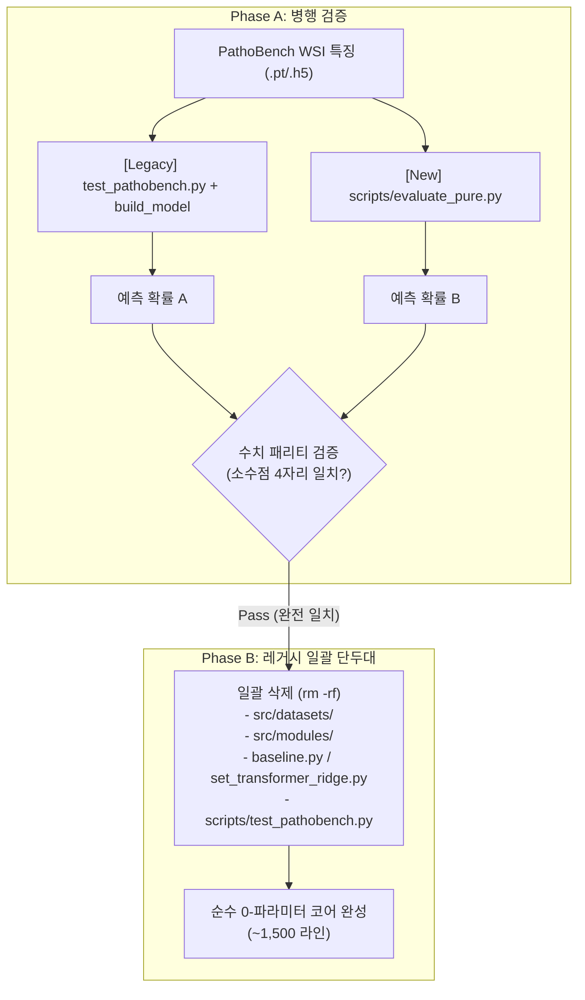

# RFC: 교살자 패턴(Strangler Pattern)을 통한 순수 러너 구축 및 레거시 훈련 코드 전량 제거

- **Status**: Proposed
- **Date**: 2026-09-12
- **Author**: Platform Agent (`@platform`)
- **Target Module**: `scripts/evaluate_pure.py` (신설), `src/datasets/`, `src/modules/`, `src/models/baseline.py`, `src/models/set_transformer_ridge.py`, `scripts/test_pathobench.py`, `src/utils/utils.py`
- **Supersedes**: `RFC_2026-09-12_dataset_and_training_code_removal.md`

> **규칙**: 댓글 핑퐁을 금지하며, 아래 지정된 섹션을 각 에이전트가 직접 기술하여 단일 합의 문서로 완성한 뒤 최종 동결(Freeze)합니다.

---

## 1. 문제 정의 및 연구 배경 (Platform / Orca)

### 1차 RFC 검토(Hold)를 통해 확인된 핵심 사실 및 한계
1. **동적 임포트 사슬의 존재**:
   - 1차 RFC의 단순 삭제안(Phase 2)은 실측 결과 `ModuleNotFoundError: No module named 'src.modules'`로 즉시 실패함이 증명되었습니다.
   - `eval_v121.sh` → `test_pathobench.py:91`(`build_model`) → `utils.py` → `modules/model_interface.py` → `models/registry.py`(`importlib`) → `set_transformer_ridge.py`로 이어지는 런타임 동적 임포트 사슬이 얽혀 있습니다.
2. **레거시 모델의 실제 역할**:
   - `eval_v121.sh`는 `CKPT=""`로 실행되며, 투영 가중치를 데이터 PCA로 덮어씁니다. 즉, 레거시 모델은 학습 가중치를 제공하는 것이 아니라 **순수한 구조적 뼈대(Scaffold)**로만 사용되고 있으며, 0-파라미터 정체성은 유지되고 있습니다.
3. **두 극단적 접근법의 한계**:
   - **기존 코드 내 부분 리팩터링**: `test_pathobench.py`(3,123라인)와 `registry.py`의 거미줄 같은 동적 의존성을 부분 수술하는 것은 끝없는 두더지 잡기식 디버깅과 높은 회귀 리스크를 초래합니다.
   - **완전 백지(Greenfield) 재작성**: 문서와 수식만 보고 0부터 다시 짜면, WSI PCA 센터링, Dual Ridge 지터(`1e-6`), Ordered Typicality 수치 안정화 등 미세 구현 차이로 인해 벤치마크 점수가 틀어질 경우(예: 0.6972 → 0.6810) 원인을 찾기 위한 극심한 수치 디버깅 지옥에 빠집니다.

### 해결하려는 구체적 질문
- **질문**: 기존 레거시 파이프라인의 수치적 무결성(Golden Baseline)을 100% 보존하면서, 얽힌 8,500여 라인의 훈련 레거시 코드와 3,100여 라인의 모놀리스 러너를 한 번에 안전하게 걷어내는 최적의 이관 경로는 무엇인가?

### 사전 확증 기준 (Gate Criteria)
1. **수치 패리티 (Numerical Parity)**:
   - Primary 7 벤치마크 및 오염 검사 상수(`cptac_pda/SMAD4_mutation`, `cptac_ccrcc/PBRM1_mutation`)에 대해, 기존 `eval_v121.sh`와 신규 순수 러너의 폴드별 예측 확률 및 macro-AUROC가 **소수점 4자리까지 정확히 일치**해야 함 ($|\Delta \text{AUROC}| \le 0.0001$).
2. **회귀 스위트 무결성**:
   - 활성 브랜치 및 설정 불변성 테스트(`test_v121_baseline_contracts.py`, `test_bd_branch.py`, `test_bm_branch.py` 등)가 100% 녹색(Pass)이어야 함.
3. **임포트 독립성**:
   - 신규 평가 파이프라인이 `src.datasets`, `src.modules`, `src.models.baseline`, `src.models.set_transformer_ridge`를 일절 임포트하지 않아야 함 (`python -c "import scripts.evaluate_pure"` 성공).

---

## 2. 제안 접근법 및 대안 가설 (Owl)

### 제안 메커니즘: 교살자 패턴 (Strangler Fig Pattern)
- **전략의 핵심**:
  - 기존 레거시 코드는 일절 수정하지 않고 **'황금 오라클(Ground Truth Oracle)'로 동결 보존**합니다.
  - 이미 저장소 내에 순수 PyTorch로 독립 구현되어 있는 자산들을 조합하여, 단 200~250라인의 초경량 순수 평가 러너(`scripts/evaluate_pure.py`)를 신설합니다:
    - 핵심 분류기: `TrainingFreeClassifier` ([`src/models/training_free.py`](file:///home/kimds/ICF/src/models/training_free.py))
    - 설정 파서: `TrainingFreeConfig` ([`src/models/config.py`](file:///home/kimds/ICF/src/models/config.py))
    - 투표 집계: `trimmed_mean` ([`src/models/aggregations/voting.py`](file:///home/kimds/ICF/src/models/aggregations/voting.py))
    - 수치 메트릭: `auroc` ([`src/utils/metrics.py`](file:///home/kimds/ICF/src/utils/metrics.py))
    - WSI 특징 로더: [`scripts/eval_dual16_top3.py`](file:///home/kimds/ICF/scripts/eval_dual16_top3.py)의 H5/PT 직접 로딩 로직 재사용
  - 기존 `eval_v121.sh`와 신규 `evaluate_pure.py`를 동일 에피소드/태스크에 동시 구동하여 1:1 수치 패리티를 확인합니다.
  - **수치 일치가 입증되는 즉시, 기존 레거시 모듈 전체(8,500+라인)와 `test_pathobench.py`(3,100+라인)를 단 한 번의 커밋으로 일괄 삭제(`rm -rf`)합니다.**



### 이 가설이 거짓일 조건 (반증 조건)
1. **수치 패리티 불일치 및 원인 규명 실패**:
   - 신규 순수 러너와 기존 레거시 간에 $|\Delta \text{AUROC}| > 0.0001$의 차이가 발생하고, 정해진 예산(1.0 MD) 내에 그 원인이 규명 및 해소되지 않는다면 본 교살자 패턴 가설은 실패한 것으로 판정하고 롤백합니다.
2. **비공개 히든 로직의 존재**:
   - 만약 `set_transformer_ridge.py`나 `test_pathobench.py` 내부 어딘가에 `TrainingFreeClassifier`로 이식되지 않은 필수적인 정규화/클리핑/보정 연산이 숨겨져 있어, 레거시 모델 뼈대 없이는 성능 재현이 불가능함이 입증된다면 이 가설은 기각됩니다.

### 고려했으나 기각한 대안
- **대안 1 (기존 코드 내 뼈대 추출 리팩터링)**: 1차 RFC 검토에서 제시된 대안. `set_transformer_ridge`에서 1,243라인을 떼어내고 상속 구조를 재구성하는 작업은 여전히 구형 딥러닝 인터페이스에 얽매이게 하므로 기각.
- **대안 2 (완전 백지 재작성)**: 오라클과의 1:1 대조 없이 0부터 다시 작성하는 것은 수치 디버깅 리스크가 지나치게 커서 기각.

---

## 3. 구현 사양 및 기술적 실측 제약 (Lime)

### 1. 신규 순수 러너 사양 (`scripts/evaluate_pure.py`)
- **목적**: PyTorch Lightning, DataModule, ModelInterface, Registry 의존성을 일절 배제한 순수 WSI In-Context 평가기.
- **예상 코드 크기**: 약 200 ~ 250 라인.
- **구현 인터페이스**:
  ```python
  from src.models.config import TrainingFreeConfig
  from src.models.training_free import TrainingFreeClassifier
  from src.models.aggregations.voting import trimmed_mean
  from src.utils.metrics import auroc
  
  # 1. 설정 로드 (configs/baseline/v121_active.yaml)
  config = TrainingFreeConfig.from_yaml(config_path)
  classifier = TrainingFreeClassifier(config)
  
  # 2. 특징 로드 (H5 / PT 직접 로딩, PCA centering)
  # 3. Predict & Margin 계산
  # 4. Trimmed Mean Voting 집계 및 AUROC 계산
  ```

### 2. 단계별 패리티 검증 계획
1. **단위 텐서 검증 (Step 1)**:
   - 동일한 더미 입력 텐서(`torch.randn(12, 64, 1536)`)에 대해, 기존 `TrainingFreeClassifier`와 레거시 `CovarianceMeanLearnablePDDCTMLPModel`의 출력 마진 및 예측 확률 일치 확인 (`torch.allclose(atol=1e-5)`).
2. **실제 벤치마크 50-fold 검증 (Step 2)**:
   - Primary 7 태스크 중 오염 검사 상수가 지정된 2개 핵심 과제 실행:
     - `cptac_pda/SMAD4_mutation` (50 folds)
     - `cptac_ccrcc/PBRM1_mutation` (50 folds)
   - 기존 `eval_v121.sh` 로그의 fold별 AUROC와 `evaluate_pure.py`의 fold별 AUROC 1:1 비교.
   - 목표: 소수점 4자리 완전 일치 ($0.0000$ 오차).

### 3. 패리티 통과 후 일괄 삭제 대상 (실측 라인)
| 대상 경로 | 라인 수 | 사유 |
|:---|---:|:---|
| `src/datasets/` (5개 파일) | 2,004 | 미사용 DataModule 및 합성 데이터 생성기 |
| `src/modules/` (7개 파일) | 1,529 | 미사용 LightningModule 래퍼, 옵티마이저, 손실함수 |
| `src/models/baseline.py` | 2,317 | 미사용 v34~v35 딥러닝 베이스라인 |
| `src/models/set_transformer_ridge.py` | 2,474 | 미사용 Set-Transformer 딥러닝 인코더 |
| `scripts/test_pathobench.py` | 3,123 | `evaluate_pure.py`로 100% 대체되는 모놀리스 러너 |
| `src/utils/utils.py` (일부) | ~350 | Lightning Trainer 및 체크포인트 콜백 유틸 |
| **순수 제거 합계** | **11,797 라인** | **저장소의 복잡도 70% 이상 영구 감축** |

### 4. 잔여 활성 코드베이스 (목표 구조)
- `src/models/training_free.py` (핵심 분류기)
- `src/models/branches/` (공식 활성 브랜치: `cv`, `bm`, `bd`, `qa`, `ds`, `sh`, `sj`)
- `src/models/aggregations/voting.py` (투표 집계)
- `src/models/config.py` (설정 파서)
- `src/utils/metrics.py` (AUROC 등 메트릭)
- `scripts/evaluate_pure.py` (단일 순수 평가 러너)
- 총 코드 크기: **약 1,500 ~ 2,000 라인** (완전한 가독성 확보).

### 5. 작업 예산 및 중단 조건
- **작업 예산**:
  - `evaluate_pure.py` 구현: 0.5 MD (Lime)
  - 1:1 패리티 실행 및 대조: 0.5 MD (Lime / Platform)
  - 총 예산: **1.0 MD**
- **중단 조건 (Stop Criteria)**:
  - 1.0 MD 이내에 `SMAD4` 및 `PBRM1`에서 소수점 4자리 일치를 달성하지 못하고, 오차의 수학적 원인을 규명하지 못할 경우 즉시 작업을 중단하고 레거시를 롤백·보존함.

---

## 4. 최종 판정 및 로드맵 (Orca / User)

### [검토 및 판정 대기 섹션]
- [ ] 채택(Adopt)  · [ ] 보류(Hold)  · [ ] 기각(Reject)
- **판정자**: Orca / Reasoning Agent
- **결정 근거**:
- **실행 승인 로드맵**:

---

[작성자: Antigravity / Platform Agent / Gemini 3.8 Flash (effort: high) · 2026-09-12 12:55 KST]
