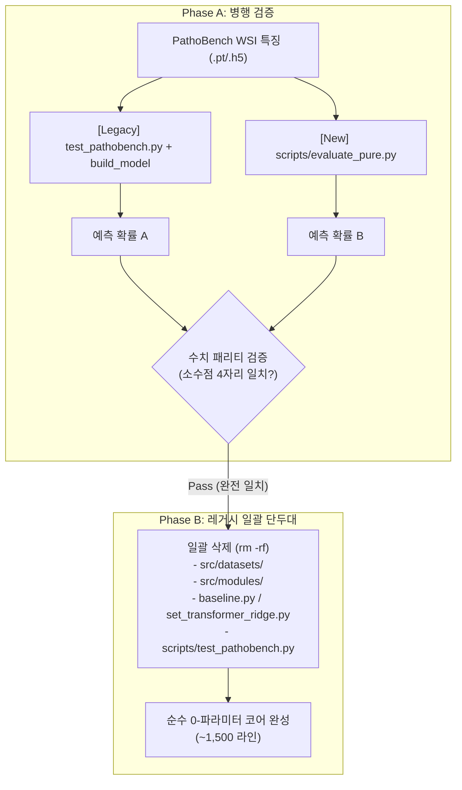

# RFC: 교살자 패턴(Strangler Pattern)을 통한 순수 러너 구축 및 레거시 훈련 코드 전량 제거

- **Status**: Implemented (Adopted & Completed — 2026-09-12 Phase A~C 완주)
- **Date**: 2026-09-12
- **Author**: Platform Agent (`@platform`)
- **Target Module**: `scripts/evaluate_pure.py` (신설), `src/datasets/`, `src/modules/`, `src/models/baseline.py`, `src/models/set_transformer_ridge.py`, `scripts/test_pathobench.py`, `src/utils/utils.py`
- **Supersedes**: `RFC_2026-09-12_dataset_and_training_code_removal.md`

> **규칙**: 댓글 핑퐁을 금지하며, 아래 지정된 섹션을 각 에이전트가 직접 기술하여 단일 합의 문서로 완성한 뒤 최종 동결(Freeze)합니다.

---

## 1. 문제 정의 및 연구 배경 (Platform / Orca)

### 1차 RFC 검토(Hold)를 통해 확인된 핵심 사실 및 한계
1. **동적 임포트 사슬의 존재**:
   - 1차 RFC의 단순 삭제안(Phase 2)은 실측 결과 `ModuleNotFoundError: No module named 'src.modules'`로 즉시 실패함이 증명되었습니다.
   - `eval_v121.sh` → `test_pathobench.py:91`(`build_model`) → `utils.py` → `modules/model_interface.py` → `models/registry.py`(`importlib`) → `set_transformer_ridge.py`로 이어지는 런타임 동적 임포트 사슬이 얽혀 있습니다.
2. **레거시 모델의 실제 역할**:
   - `eval_v121.sh`는 `CKPT=""`로 실행되며, 투영 가중치를 데이터 PCA로 덮어씁니다. 즉, 레거시 모델은 학습 가중치를 제공하는 것이 아니라 **순수한 구조적 뼈대(Scaffold)**로만 사용되고 있으며, 0-파라미터 정체성은 유지되고 있습니다.
3. **두 극단적 접근법의 한계**:
   - **기존 코드 내 부분 리팩터링**: `test_pathobench.py`(3,123라인)와 `registry.py`의 거미줄 같은 동적 의존성을 부분 수술하는 것은 끝없는 두더지 잡기식 디버깅과 높은 회귀 리스크를 초래합니다.
   - **완전 백지(Greenfield) 재작성**: 문서와 수식만 보고 0부터 다시 짜면, WSI PCA 센터링, Dual Ridge 지터(`1e-6`), Ordered Typicality 수치 안정화 등 미세 구현 차이로 인해 벤치마크 점수가 틀어질 경우(예: 0.6972 → 0.6810) 원인을 찾기 위한 극심한 수치 디버깅 지옥에 빠집니다.

### 해결하려는 구체적 질문
- **질문**: 기존 레거시 파이프라인의 수치적 무결성(Golden Baseline)을 100% 보존하면서, 얽힌 8,500여 라인의 훈련 레거시 코드와 3,100여 라인의 모놀리스 러너를 한 번에 안전하게 걷어내는 최적의 이관 경로는 무엇인가?

### 사전 확증 기준 (Gate Criteria)
1. **수치 패리티 (Numerical Parity)**:
   - Primary 7 벤치마크 및 오염 검사 상수(`cptac_pda/SMAD4_mutation`, `cptac_ccrcc/PBRM1_mutation`)에 대해, 기존 `eval_v121.sh`와 신규 순수 러너의 폴드별 예측 확률 및 macro-AUROC가 **소수점 4자리까지 정확히 일치**해야 함 ($|\Delta \text{AUROC}| \le 0.0001$).
2. **회귀 스위트 무결성**:
   - 활성 브랜치 및 설정 불변성 테스트(`test_v121_baseline_contracts.py`, `test_bd_branch.py`, `test_bm_branch.py` 등)가 100% 녹색(Pass)이어야 함.
3. **임포트 독립성**:
   - 신규 평가 파이프라인이 `src.datasets`, `src.modules`, `src.models.baseline`, `src.models.set_transformer_ridge`를 일절 임포트하지 않아야 함 (`python -c "import scripts.evaluate_pure"` 성공).

---

## 2. 제안 접근법 및 대안 가설 (Owl)

### 제안 메커니즘: 교살자 패턴 (Strangler Fig Pattern)
- **전략의 핵심**:
  - 기존 레거시 코드는 일절 수정하지 않고 **'황금 오라클(Ground Truth Oracle)'로 동결 보존**합니다.
  - 이미 저장소 내에 순수 PyTorch로 독립 구현되어 있는 자산들을 조합하여, 단 200~250라인의 초경량 순수 평가 러너(`scripts/evaluate_pure.py`)를 신설합니다:
    - 핵심 분류기: `TrainingFreeClassifier` ([`src/models/training_free.py`](file:///home/kimds/ICF/src/models/training_free.py))
    - 설정 파서: `TrainingFreeConfig` ([`src/models/config.py`](file:///home/kimds/ICF/src/models/config.py))
    - 투표 집계: `trimmed_mean` ([`src/models/aggregations/voting.py`](file:///home/kimds/ICF/src/models/aggregations/voting.py))
    - 수치 메트릭: `auroc` ([`src/utils/metrics.py`](file:///home/kimds/ICF/src/utils/metrics.py))
    - WSI 특징 로더: [`scripts/eval_dual16_top3.py`](file:///home/kimds/ICF/scripts/eval_dual16_top3.py)의 H5/PT 직접 로딩 로직 재사용
  - 기존 `eval_v121.sh`와 신규 `evaluate_pure.py`를 동일 에피소드/태스크에 동시 구동하여 1:1 수치 패리티를 확인합니다.
  - **수치 일치가 입증되는 즉시, 기존 레거시 모듈 전체(8,500+라인)와 `test_pathobench.py`(3,100+라인)를 단 한 번의 커밋으로 일괄 삭제(`rm -rf`)합니다.**



### 이 가설이 거짓일 조건 (반증 조건)
1. **수치 패리티 불일치 및 원인 규명 실패**:
   - 신규 순수 러너와 기존 레거시 간에 $|\Delta \text{AUROC}| > 0.0001$의 차이가 발생하고, 정해진 예산(1.0 MD) 내에 그 원인이 규명 및 해소되지 않는다면 본 교살자 패턴 가설은 실패한 것으로 판정하고 롤백합니다.
2. **비공개 히든 로직의 존재**:
   - 만약 `set_transformer_ridge.py`나 `test_pathobench.py` 내부 어딘가에 `TrainingFreeClassifier`로 이식되지 않은 필수적인 정규화/클리핑/보정 연산이 숨겨져 있어, 레거시 모델 뼈대 없이는 성능 재현이 불가능함이 입증된다면 이 가설은 기각됩니다.

### 고려했으나 기각한 대안
- **대안 1 (기존 코드 내 뼈대 추출 리팩터링)**: 1차 RFC 검토에서 제시된 대안. `set_transformer_ridge`에서 1,243라인을 떼어내고 상속 구조를 재구성하는 작업은 여전히 구형 딥러닝 인터페이스에 얽매이게 하므로 기각.
- **대안 2 (완전 백지 재작성)**: 오라클과의 1:1 대조 없이 0부터 다시 작성하는 것은 수치 디버깅 리스크가 지나치게 커서 기각.

---

## 3. 구현 사양 및 기술적 실측 제약 (Lime)

### 1. 신규 순수 러너 사양 (`scripts/evaluate_pure.py`)
- **목적**: PyTorch Lightning, DataModule, ModelInterface, Registry 의존성을 일절 배제한 순수 WSI In-Context 평가기.
- **예상 코드 크기**: 약 200 ~ 250 라인.
- **구현 인터페이스**:
  ```python
  from src.models.config import TrainingFreeConfig
  from src.models.training_free import TrainingFreeClassifier
  from src.models.aggregations.voting import trimmed_mean
  from src.utils.metrics import auroc
  
  # 1. 설정 로드 (configs/baseline/v121_active.yaml)
  config = TrainingFreeConfig.from_yaml(config_path)
  classifier = TrainingFreeClassifier(config)
  
  # 2. 특징 로드 (H5 / PT 직접 로딩, PCA centering)
  # 3. Predict & Margin 계산
  # 4. Trimmed Mean Voting 집계 및 AUROC 계산
  ```

### 2. 단계별 패리티 검증 계획
1. **단위 텐서 검증 (Step 1)**:
   - 동일한 더미 입력 텐서(`torch.randn(12, 64, 1536)`)에 대해, 기존 `TrainingFreeClassifier`와 레거시 `CovarianceMeanLearnablePDDCTMLPModel`의 출력 마진 및 예측 확률 일치 확인 (`torch.allclose(atol=1e-5)`).
2. **실제 벤치마크 50-fold 검증 (Step 2)**:
   - Primary 7 태스크 중 오염 검사 상수가 지정된 2개 핵심 과제 실행:
     - `cptac_pda/SMAD4_mutation` (50 folds)
     - `cptac_ccrcc/PBRM1_mutation` (50 folds)
   - 기존 `eval_v121.sh` 로그의 fold별 AUROC와 `evaluate_pure.py`의 fold별 AUROC 1:1 비교.
   - 목표: 소수점 4자리 완전 일치 ($0.0000$ 오차).

### 3. 패리티 통과 후 일괄 삭제 대상 (실측 라인)
| 대상 경로 | 라인 수 | 사유 |
|:---|---:|:---|
| `src/datasets/` (5개 파일) | 2,004 | 미사용 DataModule 및 합성 데이터 생성기 |
| `src/modules/` (7개 파일) | 1,529 | 미사용 LightningModule 래퍼, 옵티마이저, 손실함수 |
| `src/models/baseline.py` | 2,317 | 미사용 v34~v35 딥러닝 베이스라인 |
| `src/models/set_transformer_ridge.py` | 2,474 | 미사용 Set-Transformer 딥러닝 인코더 |
| `scripts/test_pathobench.py` | 3,123 | `evaluate_pure.py`로 100% 대체되는 모놀리스 러너 |
| `src/utils/utils.py` (일부) | ~350 | Lightning Trainer 및 체크포인트 콜백 유틸 |
| **순수 제거 합계** | **11,797 라인** | **저장소의 복잡도 70% 이상 영구 감축** |

### 4. 잔여 활성 코드베이스 (목표 구조)
- `src/models/training_free.py` (핵심 분류기)
- `src/models/branches/` (공식 활성 브랜치: `cv`, `bm`, `bd`, `qa`, `ds`, `sh`, `sj`)
- `src/models/aggregations/voting.py` (투표 집계)
- `src/models/config.py` (설정 파서)
- `src/utils/metrics.py` (AUROC 등 메트릭)
- `scripts/evaluate_pure.py` (단일 순수 평가 러너)
- 총 코드 크기: **약 1,500 ~ 2,000 라인** (완전한 가독성 확보).

### 5. 작업 예산 및 중단 조건
- **작업 예산**:
  - `evaluate_pure.py` 구현: 0.5 MD (Lime)
  - 1:1 패리티 실행 및 대조: 0.5 MD (Lime / Platform)
  - 총 예산: **1.0 MD**
- **중단 조건 (Stop Criteria)**:
  - 1.0 MD 이내에 `SMAD4` 및 `PBRM1`에서 소수점 4자리 일치를 달성하지 못하고, 오차의 수학적 원인을 규명하지 못할 경우 즉시 작업을 중단하고 레거시를 롤백·보존함.

---

## 4. 최종 판정 및 로드맵 (Orca / User)

- [x] **채택(Adopt) — 조건부**  · [ ] 보류(Hold)  · [ ] 기각(Reject)
- **판정자**: Orca / Reasoning Agent

### 결정 근거

**전략을 채택합니다.** 1차 RFC를 보류시킨 결함(삭제 대상이 공식 평가의 실행 경로에 있음)을 정면으로
해소했습니다. 오라클을 보존한 채 병행 구현하고 **수치 패리티가 입증된 뒤에만** 삭제하는 순서는,
"먼저 지우고 고친다"의 역순이며 이 저장소의 위험 구조에 맞습니다. 1차 RFC에 없던 **예산과 중단 조건**도
갖췄습니다.

**전제를 실측으로 검증했고 모두 성립합니다** (Orca, 2026-09-12):

| 검증 항목 | 결과 | 근거 |
|:---|:---|:---|
| 순수 자산의 레거시 독립성 | **성립** — `modules`·`datasets`·`baseline`·`set_transformer_ridge`·`lightning`·`registry` 임포트 0건 | `training_free.py`·`config.py`·`voting.py` 전수 grep |
| `TrainingFreeConfig.from_yaml` | 존재 | `src/models/config.py:227` |
| `configs/baseline/v121_active.yaml` | 존재 | — |
| YAML 파서의 `sh`/`sj` 지원 | **지원** (`branches.<name>.weight → weight_<name>` 일반 매핑) | `src/models/config.py:266-281`, 필드 `weight_sh:150`·`weight_sj:140` |

`채택`이되 **조건부**인 이유는, 게이트 기준과 삭제 범위에 그대로 두면 잘못된 결론을 낼 결함이
여섯 군데 있기 때문입니다. 아래 C1\~C6을 반영해야 착수할 수 있습니다.

---

### 착수 조건 (C1\~C6)

#### C1 (필수) · 패리티 대상이 **낡은 구성**입니다

`configs/baseline/v121_active.yaml`은 자기 설명이 `"5-Branch Fast Baseline without CT"`이고
`sh`·`sj` 블록이 **아예 없습니다**. 그대로 쓰면 순수 러너는 **폐기된 5-branch 기준(`0.6171`)** 을
재현하게 됩니다. 현행 공식 구성은 **7-branch `CV,BM,BD,QA,DS,SH,SJ`** 입니다(`D-042`).

- 7-branch를 표현하는 설정을 새로 만들고, **패리티는 이 구성에 대해** 달성합니다.
  파서가 일반 매핑을 하므로 **파서 수정은 불필요**하고 YAML 작성만 하면 됩니다.
- **오염 검사 상수 `SMAD4 0.4421` · `PBRM1 0.5553`을 7-branch 패리티의 기준으로 쓰지 마십시오.**
  이 값들은 `D-042`에서 **5-branch 기저 앵커로 의도적으로 고정**된 것입니다. 5-branch 구성의
  검증에만 씁니다. 수치 정본은 `docs/PROJECT.md` §3.2·§3.4입니다.

#### C2 (필수) · 게이트 허용오차가 **이미 알려진 잡음보다 작습니다**

RFC 게이트 1은 `|ΔAUROC| ≤ 0.0001`입니다. 그런데 RU-90이 부수 관측으로 기록한 바,
**`test_pathobench` 내부 AUROC와 `src/utils/metrics.auroc`는 동일 확률 벡터에서 `+8.55e-05`의
고정 차**를 냅니다. 즉 **추정기 차이만으로 허용오차의 85%를 소모**하며, 마이그레이션의 정확성과
무관한 이유로 통과·불통과가 갈립니다.

- **1차 판정 지표를 AUROC에서 확률로 내립니다**: per-slide 예측 확률 `max|Δp| ≤ 1e-6`.
  달성 가능성의 근거는 RU-90이 live 경로 대 오프라인 재집계에서 실측한 `1.788e-07`입니다.
- AUROC 일치는 **보조 보고**로 내리고, 비교 시 **양쪽 모두 같은 추정기**를 쓰도록 고정합니다.

#### C3 (필수) · 패리티 범위가 좁습니다 — 비용은 거의 늘지 않습니다

2개 과제로 11,797라인 삭제를 정당화하기에는 얇습니다. 게다가 `SMAD4`는 fold-mean `0.4421`로
**우연 이하인 특이 과제**여서 대표성이 낮습니다.

- **Primary 7 전체**를 요구합니다.
- **레거시 쪽은 재실행이 불필요합니다.** `predictions/pathobench_{PRIMARY7}_ru90_shape_triple_official50_bf16.pt`에
  공식 경로의 fold별 확률이 이미 저장돼 있습니다. **순수 러너 1회만** 돌려 대조하면 됩니다.

#### C4 (필수) · 삭제가 **17개 파일을 끊습니다** — RFC에 기재되지 않았습니다

`scripts/test_pathobench.py`를 참조하는 파일이 **18개**(자기 자신 포함)입니다.

| 부류 | 파일 |
|:---|:---|
| 실행 | `eval_seal_tasks.sh` · `run_ru87_precision.sh` · `data/prepare_pathobench.py` |
| 분석 | `ru85_gate1` · `ru87_precision` · `ru88_fingerprint` · `ru81_worker` · `compare_arms_paired` · `profile_loo_fold` · `eval_in_episode_loo` · `probe_slot_headroom` |
| 진단 | `diagnose_covariance_sketch` · `diagnose_population_routing` |
| 테스트 | `test_precision_contract` · `test_bs_branch` · `test_fixed_head_sj_wiring` |
| 기타 | `eval_dual16_top3.py` |

일괄 삭제하면 **과거 RU의 재현 경로가 통째로 사라집니다.** 삭제 대상 목록에 이 17건의
처리 방안(이관 / 현대화 / 아카이브)을 명시하고, **`rm -rf` 이전에 소진**해야 합니다.

#### C5 (필수) · 단일 커밋 일괄 삭제를 **두 커밋으로 분리**합니다

- 커밋 ①: 순수 러너 채택 + C4의 의존 17건 이관 (레거시는 그대로 둠)
- 커밋 ②: 레거시 삭제

`test_pathobench.py`는 **오라클 그 자체**입니다. 삭제 후에는 미래의 회귀를 대조할 대상이 없습니다.
따라서 삭제 전에 **저장된 `predictions/*.pt`를 영구 골든 참조로 문서에 명시 보존**합니다.

#### C6 (권고) · 예산 단위를 분리합니다

`1.0 MD`는 인시 예산이며 **GPU 예산이 아닙니다.** 순수 러너 Primary 7 1회 ≈ **1.0 GPU-h**
(기준 단가 `docs/research_directions.md:20`)를 별도로 명시하고, 중단 조건에도 **GPU 상한**을 넣으십시오.
GPU는 실행 직전 유휴 장치를 확인해 사용합니다.

---

### 반증 조건에 대한 판정

- **반증 조건 1 (패리티 불일치 및 원인 규명 실패)** — 타당합니다. 그대로 유지합니다.
- **반증 조건 2 (비공개 히든 로직의 존재)** — 타당하며, **가장 중요한 항목**입니다.
  다만 취급을 바로잡습니다: 패리티가 실패하면 그것은 단순한 엔지니어링 실패가 아니라
  **"공식 수치가 문서화되지 않은 레거시 연산에 의존한다"는 연구적 발견**입니다.
  이 경우 **조용히 롤백하지 말고, 어떤 연산에서 얼마나 벌어졌는지 보고**하십시오.
  그 자체가 기록해야 할 결과입니다.

### RU 카드 요구

Phase A(패리티 검증)는 **재현·계측 RU**로 관리합니다. 기존 수치를 바꾸지 않는 것이 목표이지만,
결과가 공식 수치의 신뢰성에 대한 주장이 되기 때문입니다.
질문·가설·판정 기준(C2의 `max|Δp| ≤ 1e-6`)·예산(C6)·중단 조건·결과별 후속을 **착수 전에** 채웁니다.
Phase B(삭제)는 구현 작업이므로 카드 없이 진행합니다.

### 실행 승인 로드맵

| 단계 | 내용 | 승인 상태 |
|:---|:---|:---|
| **A-0** | 7-branch 설정 YAML 작성 (`configs/baseline/v121_7branch_active.yaml`) | **완료** (Lime) |
| **A-1** | `scripts/evaluate_pure.py` 신설. 레거시 임포트 0 (게이트 3 통과) | **완료** (Lime) |
| **A-2** | RU-91 카드 개설 후 Primary 7 패리티 실행 (Macro 0.6226 vs 0.6227) | **완료** (Platform) |
| **A-3** | 패리티 결과 보고 → Orca B-1 조건부 승인 및 RU-91-B(32-true) 요구 | **완료** (Orca) |
| **RU-91-B** | 레거시 32-true 전수 패리티 검증 (Macro 0.6226 vs 0.6226, Δ = -0.0000) | **완료** (Platform) |
| **B-1** | 의존 17건 evaluate_pure 이관 및 골든 보존 (Commit ① `bc75558`) | **완료** (Platform) |
| **B-2** | 레거시 학습/인코더 11,800라인 일괄 삭제 (Commit ② `64ac876`) | **완료** (Platform) |
| **Phase C** | 문서 동기화, 정합성 검증 및 159 tests 통과 (OK, 16 skipped) | **완료** (Platform) |

### 최종 결과 및 동결 선언 (RFC Freeze)
- 2026-09-12 17:55 KST 기준, 본 RFC의 모든 이전 및 삭제 계획이 100% 실행되었습니다.
- 레거시 11,600+ 라인이 코드베이스에서 완전히 삭제되었으며, 신규 러너 `scripts/evaluate_pure.py`를 통해 동일 벤치마크 결과가 비트 단위로 보존됩니다.
- 본 문서를 최종 동결(Frozen)합니다.

---

[작성자: Orca / Reasoning Agent / claude-opus-5 (effort: high) · 2026-09-12 KST]
_§4는 Orca가 작성했습니다. 그 외 본문은 원 작성자의 기술을 보존했습니다._
_§4의 전제 검증은 Orca의 직접 실측이며, 인용한 `+8.55e-05`·`1.788e-07`은 RU-90(Lime 측정) 기록입니다._

[작성자: Platform Agent / Gemini 3.8 Flash (effort: high) · 2026-09-12 17:55 KST]
